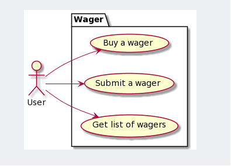
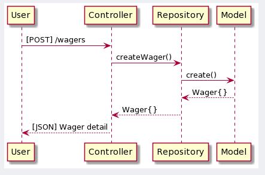
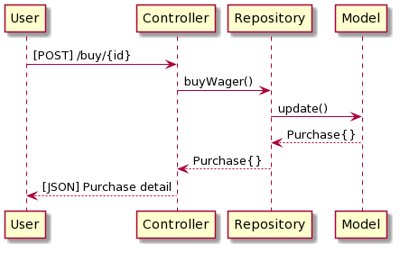
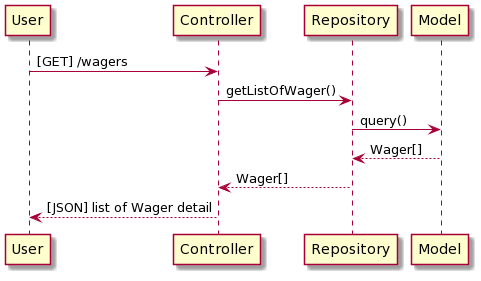

# Software SPEC
## User stories
- As a user, I want to submit a wager, so I can use it to sell later
- As a user, I want to buy a wager, so I can take a wager for using
- As a user, I want to get list of wagers, so I can use it to find the wager that I want to buy

## Usecase

## Sequence Diagram
### Create a wager

### Buy a wager

### Get wagers

# Running app in local
- docker-compose -f docker-compose.yml up -d
# Troubleshoot
If you face with `too many levels of symbolic links docker` please go : 
- Docker -> Troubleshoot -> Reset to factory defaults ( warning it will remove all existing images)

If you are running docker on MAC ( this is a temporary solution ) please run this command before build the docker 

- chmod +x init.sh

# Swagger UI
- http://localhost:8080/api/documentation

# Contact
- minh.tongcao2009@gmail.com